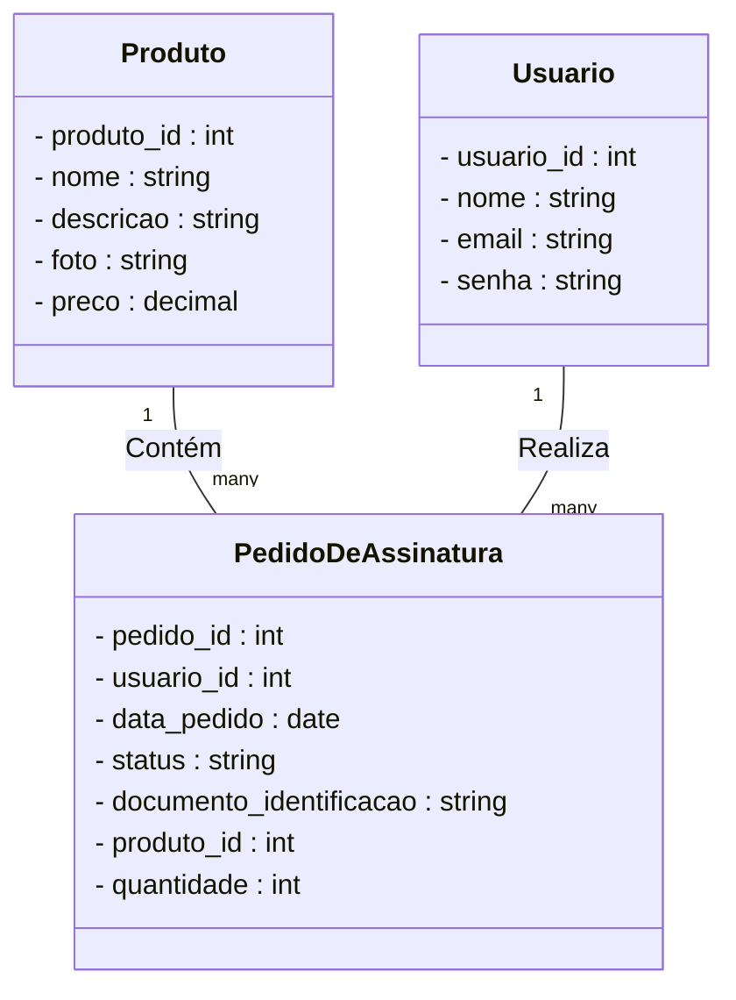

# Allu. Website

Uma aplicação fullStack desenvolvida com node.js, Next.js, React, Express e TypeScript com o padrão de microsserviços para gerar um website focado em produtos por assinatura

## 🚀 Começando

Essas instruções permitirão que você obtenha uma cópia do projeto em operação na sua máquina local para fins de desenvolvimento e teste.

### 📋 Pré-requisitos

De que coisas você precisa para instalar o software e como instalá-lo?

```bash
# ter o repositório clonado em sua máquina
  git clone git@github.com:guiduzera/Allu.FullStack-website.git
```

### * Atenção: Preferível abrir o repositório pelo git BASH, máquina com WSL ou nativa Linux

### 🔧 Instalação

### Após o clone do prójeto na raíz digite o seguinte comando

```bash
    npm run compose:up
```

### Esse comando levantará o docker-compose e todos os containers necessários para rodar a aplicação em sua respectivas portas

### Então acesse:

* [frontend - localhost:3000](http://localhost:3000) - front da aplicação
* [serviço api - localhost:3001](http://localhost:3001) - serviço que compreende produtos e pedidos
* [serviço security - localhost:3002](http://localhost:3002) - serviço que compreende o fluxo de segurança e autenticação
* [database - localhost:3003](http://localhost:3003) - database que agrupa os produtos e pedidos
* [databasesecurity - localhost:3004](http://localhost:3004) - database que agrupa os usuários

Caso queria derrubar os conteiners basta digitar o seguinte comando na raíz do projeto:

```bash
    npm run compose:down
```

## ⚙️ Executando os testes

Explicar como executar os testes automatizados para este sistema.

### 🔩 Analise os testes de ponta a ponta

Explique que eles verificam esses testes e porquê.

```
Dar exemplos
```

### ⌨️ E testes de estilo de codificação

Explique que eles verificam esses testes e porquê.

```
Dar exemplos
```

## 🛠️ Construído com

* [Next.js e React](https://nextjs.org/) - O framework web front-end usado
* [styled-components](https://styled-components.com/) - Framework de CSS
* [TypeScript](https://www.typescriptlang.org/pt/) - Linguagem de programação
* [Express](https://expressjs.com/pt-br/) - Framework back-end utilizado
* [MySQL](https://www.mysql.com/) - Banco de dados relacional usado
* [Prisma](https://www.prisma.io/) - ORM utilizado
* [Docker](https://www.docker.com/) - Containerizador
* [Jest](https://jestjs.io/pt-BR/) - Testes unitários
* [Eslint](https://eslint.org/) - Garantir padrões de código

## 📌 Versão

1.0.0

## ✒️ Autores

* **Guilherme Carvalho** - *Trabalho Inicial* - [Github](https://github.com/guiduzera)

## 🎁 Expressões de gratidão

* Convide o autor para tomar uma cerveja 🍺;
* Um agradecimento publicamente à Thiago Silva;

---
⌨️ com ❤️ por [Guilherme Carvalho](https://github.com/guiduzera) 😊

# colocar depois no backend


