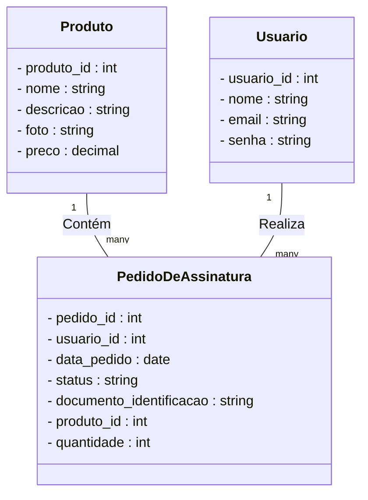

# Allu. Website

Uma aplicação fullStack desenvolvida com node.js, Next.js, React, Express e TypeScript com o padrão de microsserviços para gerar um website focado em produtos por assinatura

## 🚀 Começando

Essas instruções permitirão que você obtenha uma cópia do projeto em operação na sua máquina local para fins de desenvolvimento e teste.

Consulte **[Implantação](#-implanta%C3%A7%C3%A3o)** para saber como implantar o projeto.

### 📋 Pré-requisitos

De que coisas você precisa para instalar o software e como instalá-lo?

```
Dar exemplos
```

### 🔧 Instalação

Uma série de exemplos passo-a-passo que informam o que você deve executar para ter um ambiente de desenvolvimento em execução.

Diga como essa etapa será:

```
Dar exemplos
```

E repita:

```
Até finalizar
```

Termine com um exemplo de como obter dados do sistema ou como usá-los para uma pequena demonstração.

## ⚙️ Executando os testes

Explicar como executar os testes automatizados para este sistema.

### 🔩 Analise os testes de ponta a ponta

Explique que eles verificam esses testes e porquê.

```
Dar exemplos
```

### ⌨️ E testes de estilo de codificação

Explique que eles verificam esses testes e porquê.

```
Dar exemplos
```

## 🛠️ Construído com

* [Next.js e React](http://www.dropwizard.io/1.0.2/docs/) - O framework web front-end usado
* [styled-components](https://maven.apache.org/) - Framework de CSS
* [TypeScript](https://rometools.github.io/rome/) - Linguagem de programação
* [Express]() - Framework back-end utilizado
* [PostgreSQL]() - Banco de dados relacional usado
* [Prisma]() - ORM utilizado
* [Docker]() - Containerizador
* [Jest]() - Testes unitários
* [Eslint]() - Garantir padrões de código
* [Swagger]() - Documentação da API

## 📌 Versão

1.0.0

## ✒️ Autores

* **Guilherme Carvalho** - *Trabalho Inicial* - [Github](https://github.com/guiduzera)

## 🎁 Expressões de gratidão

* Convide alguém da equipe para uma cerveja 🍺;
* Um agradecimento publicamente 🫂;

---
⌨️ com ❤️ por [Guilherme Carvalho](https://github.com/guiduzera) 😊

# colocar depois no backend


