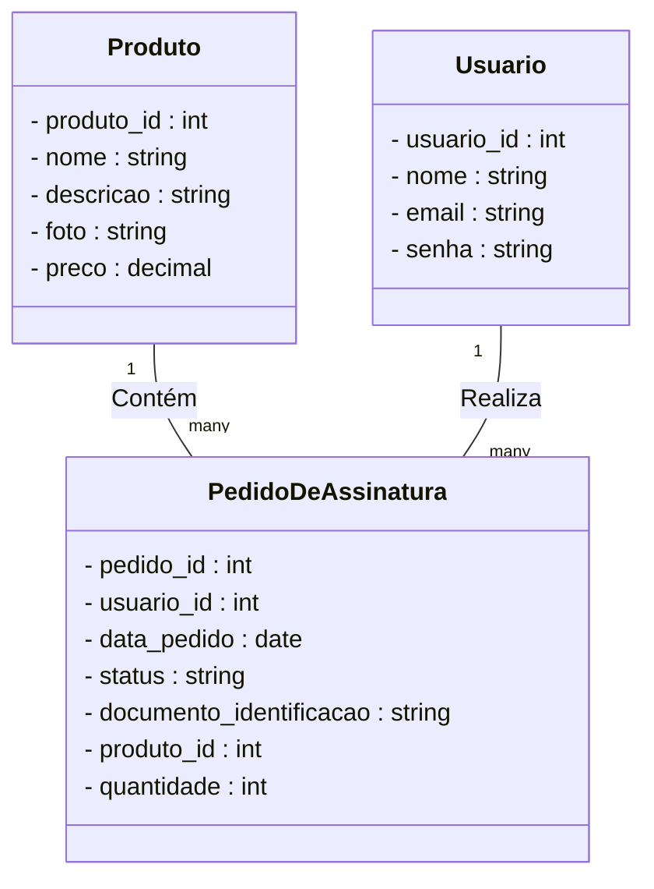

# Allu. Website

Uma aplicação fullStack desenvolvida com Node.js, Next.js, React, Express, TypeScript e MySQL com o padrão de microsserviços para gerar um website focado em produtos por assinatura

## 🚀 Começando

Essas instruções permitirão que você execute uma cópia do projeto em operação na sua máquina local para fins de desenvolvimento e teste.

### 📋 Pré-requisitos

   Ambiente Windows:
    - Git Bash
    - DockerDesktop

   Ambiente Linux
    - Git (Nativo)
    - Docker (Nativo)

### * Atenção: Preferível abrir o repositório pelo git BASH, máquina com WSL ou nativa Linux

### 🔧 Instalação

Inicie clonando o projeto
```bash
# ter o repositório clonado em sua máquina
  git clone git@github.com:guiduzera/Allu.FullStack-website.git
```

### * Atenção: Sempre verifique se seu código local está alinhado com repositório remoto!!

### Após o clone do prójeto, na raíz do diretório digite o seguinte comando

```bash
    npm run compose:up
```

### Esse comando vai instanciar todos os containers necessários para rodar a aplicação com todas as configurações necessárias, conforme abaixo:

* [frontend - localhost:3000](http://localhost:3000) - front da aplicação
* [serviço api - localhost:3001](http://localhost:3001) - serviço que compreende produtos e pedidos
* [serviço security - localhost:3002](http://localhost:3002) - serviço que compreende o fluxo de segurança e autenticação
* [database - localhost:3003](http://localhost:3003) - database que agrupa os produtos e pedidos
* [databasesecurity - localhost:3004](http://localhost:3004) - database que agrupa os usuários

### Agora basta acessar o frontend da aplicação através do endereço abaixo:

[frontend - localhost:3000](http://localhost:3000) - front da aplicação

:exclamation::exclamation::exclamation::exclamation::point_down::point_down::exclamation::exclamation::exclamation:
* Atenção: Essa aplicação foi revisada várias vezes. Após o acesso ao frontend se perceber algum erro inesperado relacionado ao acesso à API
* Execute o comando presente na instrução logo a baixo, após reinicie os containeres com o comando ```npm run compose:up```. Obrigado! :smiley:

:exclamation::exclamation::exclamation::exclamation::point_up::point_up::exclamation::exclamation::exclamation:

Para desmontar os conteiners basta digitar o seguinte comando na raíz do projeto:

```bash
    npm run compose:down
```

## 🛠️ Tecnologias utilizadas:

* [Next.js e React](https://nextjs.org/) - O framework web front-end usado
* [styled-components](https://styled-components.com/) - Framework de CSS
* [TypeScript](https://www.typescriptlang.org/pt/) - Linguagem de programação
* [Express](https://expressjs.com/pt-br/) - Framework back-end utilizado
* [MySQL](https://www.mysql.com/) - Banco de dados relacional usado
* [Prisma](https://www.prisma.io/) - ORM utilizado
* [Docker](https://www.docker.com/) - Containerizador
* [Jest](https://jestjs.io/pt-BR/) - Testes unitários
* [Eslint](https://eslint.org/) - Garantir padrões de código
* [Swagger](https://swagger.io/) - Documentação das API's

# Detalhes Backend

* Logo a baixo segue um diagrama de classes que fiz para me inspirar a estruturar a aplicação



# Documentação

 ## O backend é dividio em dois serviços, dessa forma cada um tem sua documentação separada em portas diferentes utilizando swagger

 * [documentação - serviço api ](http://localhost:3001/api-docs/)
 * [documentação - serviço security](http://localhost:3002/api-docs/)
* é necessário que todos os serviços estejam ativos.

## Acessando essas urls, é possível visualizar todas as rotas, métodos de requisição, padrões de resposta e até mesmo o usuário pode testar as rotas requisitando direto do UI apresentado

### Lembrete | Dica: Todas rotas do serviço de api são protegidas por middlewares e precisam de um token válido em seus cabeçalhos para serem acessadas

#### Assim recomendo que antes de testar as rotas pelo swagger, é necessário realizar o login via aplicação ou postmam para que a aplicação gere o "token". Após guardar o token, basta acessar o swagger novamente e clicar no "cadeado" no canto superior direito, inserir o token gerado pela aplicação e clicar em "Autorizar".

* OBSERVAÇÃO: O descritivo acima se aplica a rota "[documentação - serviço api ](http://localhost:3001/api-docs/)"

## ⚙️ Executando os testes
Antes de executar os testes é necessário navegar até o diretório raiz dos serviços api ou security

```bash
    cd App cd backend cd api

    # ou

    cd App cd backend cd security
```

Após essa etapa, basta rodar o seguinte comando:

```bash
    npm test
```

Assim todos os testes daquele respectivo serviço vão rodar de uma única só vez!

* Dica: Os testes podem ser filtrados especificando o caminho do arquivo ou pasta que precisa ser testada como no exemplo à seguir:

```bash
    npm test service/orders.test.ts
```

---

# Detalhes frontend

## O Front é feito com o framework Next.js então todo o core e paginação se encontra na pasta pages dentro de src.

## Todos os componentes se encontram na pasta "components", que seguem o seguinte padrão:
  * Nome da pasta é o nome do componente
  * Dentro da pasta terá um index.tsx e um styles.ts
  * O index abrigará a estrutura toda, e o styles.ts guardará os componentes estilizados do styled-components
  * Váriaveis úteis a todos os componentes se encontram na pasta environments

## Largura das telas utilizadas para responsividade: iPhone XR, iPad Mini, iPad Air, notebook

## 📌 Versão

1.0.0

## ✒️ Autores

* **Guilherme Carvalho** - *Trabalho Inicial* - [Github](https://github.com/guiduzera)

## 🎁 Expressões de gratidão

* Convide o autor para tomar uma cerveja 🍺;
* Um agradecimento publicamente à Thiago Silva;

---
⌨️ com ❤️ por [Guilherme Carvalho](https://github.com/guiduzera) 😊

---
